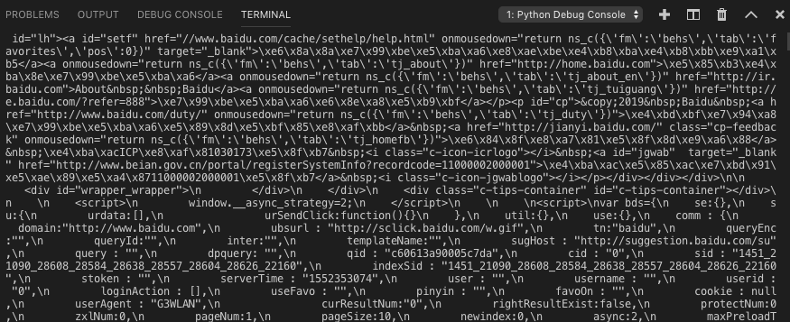

### 1.抓取一个网页
抓取网页就是根据URL来获取它的网页信息：
```
# -*- coding：utf-8 -*-
import urllib

# urllib.request 请求模块
response = urllib.request.urlopen("http://www.baidu.com")
print(response.read())
```
在vscode中按F5执行后结果如图：


这样网页就被抓去下来了。~~~~~~~~

> urlopen一般常用的有三个参数，它的参数如下：
urllib.requeset.urlopen(url,data,timeout)
response.read()可以获取到网页的内容

### 2.POST和GET数据传送
数据传送分为POST和GET两种方式，两种方式有什么区别呢？

最重要的区别是GET方式是直接以链接形式访问，链接中包含了所有的参数，当然如果包含了密码的话是一种不安全的选择，不过你可以直观地看到自己提交了什么内容。POST则不会在网址上显示所有的参数，不过如果你想直接查看提交了什么就不太方便了，大家可以酌情选择。
###### POST方式：
```
# -*- coding: UTF-8 -*-
"""
POST 演示
"""
import urllib

# 设置参数
params = {'word':'hello'}
#通过bytes(urllib.parse.urlencode())将post数据进行转换
data = bytes(urllib.parse.urlencode(params), encoding='utf-8')
url = 'http://httpbin.org/post'
response = urllib.request.urlopen(url, data)
print(response.read())
```
###### GET方式：
至于GET方式我们可以直接把参数写到网址上面，直接构建一个带参数的URL出来即可。
```
# -*- coding: UTF-8 -*-
"""
GET方式演示
"""
import urllib

values = {}
values['wd'] = 'word'
data = urllib.parse.urlencode(values)
url = 'http://www.baidu.com/s'
getUrl = url + '?' + data
print(getUrl)
response = urllib.request.urlopen(getUrl)
print(response.read())
```