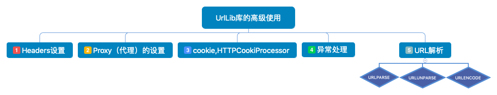

### UrlLib库的高级使用

<div align=center></div>

#### 1. Headers设置
有很多网站为了防止程序爬虫爬网站造成网站瘫痪，会需要携带一些headers头部信息才能访问，最长见的有user-agent参数

```
# -*- coding:UTF-8 -*-

# urllib.request 请求模块
# import urllib.request
# import urllib.parse
# 以上2个导入可以合并为
from urllib import request, parse
import ssl

content = ssl._create_unverified_context()

url = 'https://httpbin.org/post'
headers = {
    'User-Agent': 'Mozilla/4.0 (compatible; MSIE 5.5; Windows NT)',
    'Host': 'httpbin.org'
}
params = {
    'name': '高效码农'
}

data = bytes(parse.urlencode(params), encoding='utf8')
req = request.Request(url=url, data=data, headers=headers, method='POST')
response = request.urlopen(req, context=content)
print(response.read())
```

运行结果：
```
{
    "args": {},
    "data": "",
    "files": {},
    "form": {
        "name": "高效码农"
    },
    "headers": {
        "Accept-Encoding": "identity",
        "Content-Length": "41",
        "Content-Type": "application/x-www-form-urlencoded",
        "Host": "httpbin.org",
        "User-Agent": "Mozilla/4.0 (compatible; MSIE 5.5; Windows NT)"
    },
    "json": null,
    "origin": "222.XXX.XXX.46, 222.XXX.XXX.46",
    "url": "https://httpbin.org/post"
}
```
#### 2. Proxy（代理）的设置
网站会检测某一段时间某个IP 的访问次数，如果访问次数过多，它会禁止你的访问,所以这个时候需要通过设置代理来爬取数据
```
# -*- coding: UTF-8 -*-

import urllib.request

# 构建了代理Handler
proxy_handler = urllib.request.ProxyHandler({
    'http':'http://163.125.221.128:8118/',
})

# 创建自定义opener对象
opener = urllib.request.build_opener(proxy_handler)
response = opener.open('http://httpbin.org/get')
print(response.read())
```

运行结果：
```
{
"args": {},
"headers": {
"Accept-Encoding": "identity",
"Host": "httpbin.org",
"User-Agent": "Python-urllib/3.7"
},
"origin": "163.125.221.128, 163.125.221.128",
"url": "https://httpbin.org/get"
}
```

> 这里有可能报错 <font color='red'>HTTP Error 503: Too many open connections</font> 可能是因为使用的免费动态代理IP设置了并发数

#### 3. cookie,HTTPCookiProcessor
cookie中保存中我们常见的登录信息，有时候爬取网站需要携带cookie信息访问,这里用到了http.cookijar，用于获取cookie以及存储cookie
```
# -*_ coding:UTF-8 -*-

import http.cookiejar, urllib.request

# 创建一个CookieJar类
cookie = http.cookiejar.CookieJar()
# HTTPCookieProcessor
handler = urllib.request.HTTPCookieProcessor(cookie)
# 创建一个OpenerDirector类
opener = urllib.request.build_opener(handler)
response = opener.open('http://www.baidu.com')
for item in cookie:
    print(item.name+"="+item.value)

```
运行结果：
```
BAIDUID=19C8971FC1A9C9562D9F24002AA9A54F:FG=1
BIDUPSID=19C8971FC1A9C9562D9F24002AA9A54F
H_PS_PSSID=1425_21092_18560_28607_28585_26350_28518_28626_28606
PSTM=1552363396
delPer=0
BDSVRTM=0
BD_HOME=0
```

#### 4. 异常处理
在很多时候我们通过程序访问页面的时候，有的页面可能会出现错误，类似404，500等错误
```
# -*- coding:UTF-8 -*-

from urllib import request, error

try:
    response = request.urlopen('http://pythonsite.com/1111.html')
except error.URLError as e:
    print(e.reason)
```
运行结果：
> Not Found

> 在urllb中有三个异常错误类：URLError、HTTPError、ContentTooShortError
>- URLError里只有一个属性：reason,即抓异常的时候只能打印错误信息，类似上面的例子
>- HTTPError里有三个属性：code,reason,headers，即抓异常的时候可以获得code,reson，headers三个信息，例子如下：

```
try:
    response = request.urlopen('http://pythonsite.com/1111.html')
except error.HTTPError as e:
    print(e.reason)
    print(e.code)
    print(e.headers)
```
运行结果：
```
Not Found
404
Date: Tue, 12 Mar 2019 05:52:30 GMT
Server: Apache
Vary: Accept-Encoding
Content-Length: 207
Connection: close
Content-Type: text/html; charset=iso-8859-1
```

#### 5. URL解析

###### urlparse:URL解析功能侧重于将URL字符串拆分为其组件，或者将URL组件组合为URL字符串。
```
# -*- coding:UTF-8 -*-
from urllib.parse import urlparse

result = urlparse('http://www.baidu.com/index.html;user?id=5#comment')
print(result)
```
运行结果：
```
ParseResult(scheme='http', netloc='www.baidu.com', path='/index.html', params='user', query='id=5', fragment='comment')
```
> 协议：http
  位置：www.baidu.com
  路径：/index.html
  参数：params='user'
  查询：query='id=5'
  片段：fragment='comment'

###### urlunparse：功能和urlparse的功能相反，它是用于拼接
```
# urlunparse
data = ['http','xugj520.cn', 'index.html', 'user','a=123','commit']
print(urlunparse(data))
```
运行结果：
```
http://xugj520.cn/index.html;user?a=123#commit
```
###### urlencode:这个方法可以将字典转换为url参数
```
# urlencode
params = {
    'name':'高效码农',
    'blog':'xugj520.cn'
}
base_url = 'https://xugj520.cn?'
url = base_url + urlencode(params)
print(url)
```
运行结果：
> https://xugj520.cn?name=%E9%AB%98%E6%95%88%E7%A0%81%E5%86%9C&blog=xugj520.cn

